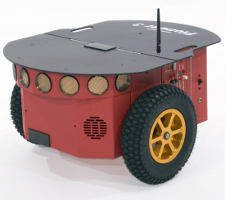

# BIR  Challenge 2021

Challenge for act as undergraduate intern in the Robotics and Autonomous Systems Laboratory, in SENAI CIMATEC, 2021.

The purpose of the challenge is to develop an autonomous navigation system, so that the robot reaches an illuminated region, next to a STOP sign, avoiding obstacles. The simulation must be realized in the [Webots](https://cyberbotics.com/) software, and the robot must reach its goal in less then 2 minutos, starting near the START sign.

Challenge repository: https://github.com/Brazilian-Institute-of-Robotics/desafiorobotica

## The repository
The folders are organized as follows:

- `controllers` - Controller used for the challenge
- `resources` - Resources used in the README and video of the simulation
- `world` - Contains the world of simulation

**Table of Contents - ReadMe**
- [BIR  Challenge 2021](#bir--challenge-2021)
  - [The repository](#the-repository)
  - [The Challenge](#the-challenge)
    - [Robot](#robot)
    - [Sensors](#sensors)
    - [Controller](#controller)
  - [Results](#results)

## The Challenge

### Robot

The robot used for the challenge was [Pioneer 3-DX](https://www.generationrobots.com/en/402395-robot-mobile-pioneer-3-dx.html). It's a compact differential-drive mobile robot, very reliable and highly customisable.

Webots documentation about this robot can be viewed in [this link](https://cyberbotics.com/doc/guide/pioneer-3dx).

### Sensors
The Pioneer 3-DX, used in the challenge, has 16 Distance Sensors attached. They will be used to get information from the environment, so that it is possible to avoid obstacles.

For this challenge, the robot mission is to reach a region illuminated by a lamp.  For that, a Light Sensor was added to the robot, so that it is possible to identify when that region was reached.

### Controller
To control the robot behavior, and what it needs to do, to avoid the obstacles and reach the goal, all the 16 distances sensors are used, and each of then has a value that affects the direction of the robot, according to the their positions, that are added to a Weight to each wheel.

The controller used for this challenge is based on a very simplistic State Machine, wich can be seen in the diagram below.

It has four states: 
- **FORWARD:** Moves forward, and begins to turn in either direction when an obstacle is close enough, to avoid it, changing the State to  LEFT or RIGHT;
- **LEFT:** Turn left until no more obstacle are in sight;
- **RIGHT:** Turn right until no more obstacle are in sight;
- **FINISH:** When the robot reaches the goal, stop it and print the information on the screen.

The transitions are explained below:
- **Transition 1 (\_T1\_):** Right Wheel Weight greater then the threshold;
	- FORWARD  :arrow_right:  LEFT
- **Transition 2 (\_T2\_):** Left Wheel Weight greater then the threshold. Transition 1 has more priority;
	- FORWARD :arrow_right: RIGHT
- **Transition 3 (\_T3\_):** Left AND Right Wheels Weight smaller then the threshold;
	- LEFT :arrow_right: FORWARD
	- RIGHT :arrow_right: FORWARD
- **Transition 4 (\_T4\_):** Luminosity read by the Light Sensor is high enough.
	- FORWARD :arrow_right: FINISH
	- LEFT :arrow_right: FINISH
	- RIGHT :arrow_right: FINISH

## Results
The video of the simulation finished can be seen below. Note that the simulation time is not the same as the real world time. However, it is possible to see the real time at the top center of the software window, and we see that, to reach the final goal, the robot took, in real time, approximately 1 minute and 10 seconds, less than the maximum 2 minutos allowed.

